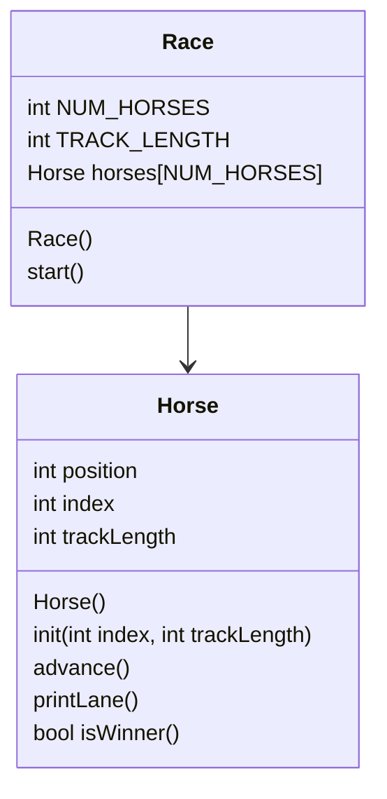

# lab5-OOP-Horse-Game

## UML



## Horse::Horse()
```
set position to 0
set index to 0
set trackLength to 15
```

## Horse::init(int index, int trackLength)
```
set position to 0
set Horse::index to index
set Horse::trackLength to trackLength
```

## Horse::advance()
```
random number generator needed (set in race)
randomly generate a number between 0 and 1 in int coin
add coin to position, result goes back into position
```

## Horse::printLane()
```
make for loop for each position in the lane
  if the current position == the horse position
    print Horse::index
  otherwise
    print a .
```

## bool Horse::isWinner()
```
set bool result to false
if position >= trackLength
  result = true
  print horse that won
return result
```

## Race::Race()
```
const static int NUM_HORSES = 5
const int TRACK_LENGTH + 15
set random number generator
initialize horse array
for each horse
  initialize with index and trackLength
```

## void Race::start()
```
bool keepGoing = true
while keepGoing
  for each horse
    advance the horse
    print its lane
    if it won
      set keepGoing to false
```
